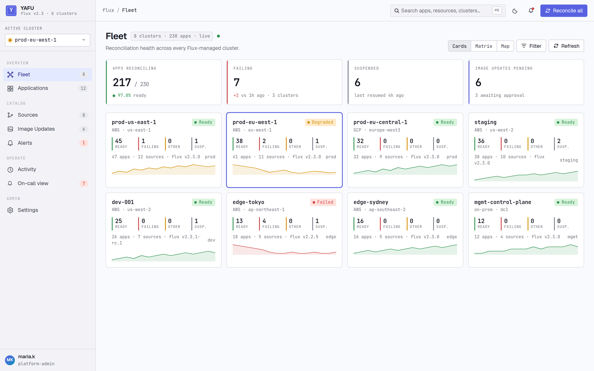

# yafu — Yet Another Flux UI

[](https://github.com/guipguia/yafu/actions/workflows/ci.yaml)
[](LICENSE)
[](https://goreportcard.com/report/github.com/guipguia/yafu)

A modern, open-source web UI for [FluxCD][flux] — see your fleet,
inspect drift, and trigger reconciles across every cluster you run
Flux in, from a single dashboard.

<!-- Drop a screenshot/GIF at docs/screenshots/fleet.png to surface it here -->
<!--  -->

## What yafu does

- **Fleet view** — every registered cluster with health, Flux version,
  ready/total resource counts, and reachability at a glance.
- **Apps** — unified list of `Kustomization`s and `HelmRelease`s with
  source refs, last-applied revision, suspend state, and drift status.
  Per-app: revision history, inventory tree, live drift diff, rendered
  Git-vs-cluster diff (kustomize / helm), pod logs (SSE-streamed),
  raw manifest.
- **Sources** — `GitRepository`, `OCIRepository`, `HelmRepository`,
  `Bucket`.
- **Alerts & events** — Flux `Alert`s with provider resolution and
  Kubernetes events filtered to the resource you're looking at.
- **Image updates** — `ImageRepository` status (image-policy and
  image-update-automation views land in v0.2).
- **Mutations** — trigger reconcile, suspend, and resume from the UI
  on Kustomizations, HelmReleases, and source resources. Audited.
- **Multi-cluster** — list endpoints fan out to every registered
  cluster in parallel; per-cluster errors come back in a partial-success
  envelope so one slow cluster doesn't break the page.

## Status

**Pre-release.** The feature set above is implemented and covered by
unit, integration, and a kind-based end-to-end test. No tagged
release yet — see [CHANGELOG.md](CHANGELOG.md).

## Quick start

```sh
# 1. Install on a cluster that already runs Flux
helm install yafu ./charts/yafu \
  --namespace yafu-system \
  --create-namespace

# 2. Register the cluster yafu itself runs in
kubectl apply -f examples/cluster-incluster.yaml

# 3. Open the UI
kubectl -n yafu-system port-forward svc/yafu 8080:80
open http://localhost:8080
```

> ⚠️ The default install runs in **anonymous auth mode** — every
> request is treated as authenticated. Fine for local evaluation,
> not for any deployment reachable from outside the cluster. See
> [Authentication](docs/auth-oidc.md) for OIDC setup.

Full step-by-step install: [docs/install.md](docs/install.md).

## Architecture

yafu is a single Go binary that:

- Watches `yafu.io/v1alpha1.Cluster` CRs to discover registered
  clusters and builds a typed `client-go` client per cluster.
- Serves a JSON API at `/api/v1/*` (OpenAPI: [api/openapi.yaml](api/openapi.yaml)).
- Embeds a React + Vite + TypeScript frontend (TanStack Query, MUI-free).
- Authenticates via three pluggable modes: anonymous, header-trust,
  or native OIDC (authorization code with PKCE).
- Authorises via a YAML policy file matching subject + verb +
  cluster glob.
- Emits Prometheus metrics, structured JSON logs, an OTLP trace
  stream, and a JSON audit log on stdout.

Deeper detail: [docs/architecture.md](docs/architecture.md). Threat
model and trust boundaries: [docs/threat-model.md](docs/threat-model.md).

## Documentation

- [Install guide](docs/install.md) — Helm chart, registering clusters
- [Authentication](docs/auth-oidc.md) — anonymous / header / OIDC,
  with Dex, Keycloak, and oauth2-proxy recipes
- [Operations runbook](docs/operations.md) — metrics, audit log,
  upgrades, troubleshooting
- [Architecture](docs/architecture.md) — packages, key flows,
  fan-out semantics
- [Threat model](docs/threat-model.md) — auth assumptions, RBAC,
  ingress trust

## Development

```sh
make install        # go mod download + npm install
make dev            # Go server (:8080) + Vite dev server (:5173) in parallel
make test           # Go unit tests + vitest
make e2e            # kind + Flux + yafu, ~5 min
make lint           # go vet, golangci-lint, eslint, prettier, tsc
```

`make dev` runs against your current `~/.kube/config` (file mode);
the embedded UI is bypassed so frontend changes hot-reload at
`http://localhost:5173`.

## Compatibility

- Kubernetes: v1.27+
- Flux: v2.0+ (controller API groups
  `kustomize.toolkit.fluxcd.io/v1`, `helm.toolkit.fluxcd.io/v2`,
  `source.toolkit.fluxcd.io/v1`,
  `notification.toolkit.fluxcd.io/v1beta3`,
  `image.toolkit.fluxcd.io/v1beta2`)

## Contributing

Issues and PRs welcome. See [CONTRIBUTING.md](CONTRIBUTING.md) and
[CODE_OF_CONDUCT.md](CODE_OF_CONDUCT.md). Security disclosures:
[SECURITY.md](SECURITY.md).

## License

MIT — see [LICENSE](LICENSE).

[flux]: https://fluxcd.io/
