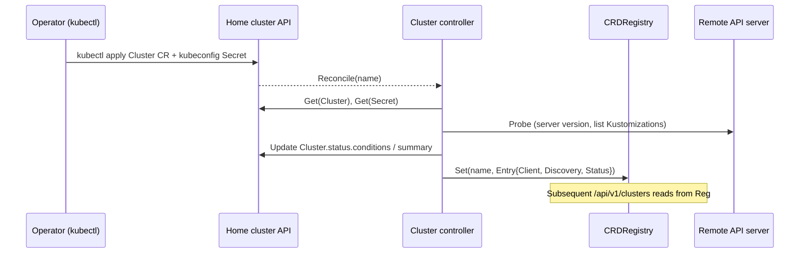
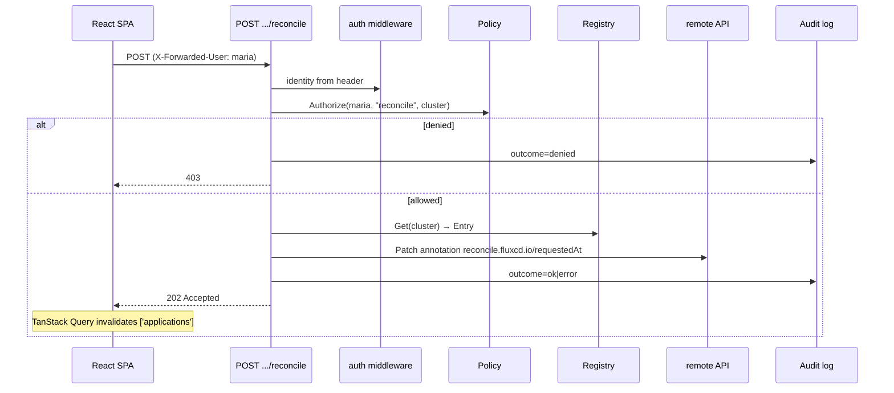

# yafu architecture

This is the v0.1 view. Phases past v0.1 (informers + SSE, native OIDC,
resource tree from Inventory) are noted but not pictured.

## Components

```mermaid
flowchart LR
    subgraph Browser
      UI[React SPA<br/>TanStack Query, 5s polling]
    end

    subgraph Home cluster
      direction TB
      Ingress[Reverse proxy<br/>oauth2-proxy / Pomerium / ingress] --> YAFU
      subgraph YAFU pod
        HTTP[HTTP server<br/>:8080]
        AUTH[auth middleware]
        API[/api/v1 handlers]
        MGR[controller-runtime<br/>manager]
        REG[Cluster registry<br/>CRD or file backed]
        AUDIT[audit log<br/>JSON to stdout]
        METRICS[/metrics<br/>Prometheus]
      end
      HTTP --> AUTH --> API
      API --> REG
      API --> AUDIT
      MGR --> REG
      HTTP --> METRICS

      CR[(yafu.io Cluster CRs)]
      SECRETS[(kubeconfig Secrets)]
      MGR --> CR
      MGR --> SECRETS
    end

    subgraph Remote clusters
      C1[Flux on prod-eu-west]
      C2[Flux on staging]
      C3[Flux on edge-tokyo]
    end

    UI -->|HTTPS| Ingress
    REG -->|client-go via per-cluster kubeconfig| C1
    REG -->|client-go| C2
    REG -->|client-go| C3
```

## Layers

| Layer | Package(s) | Responsibility |
|-------|-----------|----------------|
| HTTP server | `internal/server` | Mux setup, middleware (request-id, recover, observability), TLS termination is handled by ingress. |
| Auth | `internal/auth` | Identity resolution (anonymous / header / OIDC stub) and the RBAC policy engine. |
| API handlers | `internal/api` | One handler per resource: clusters, applications, sources, alerts, events, mutations, whoami, version, stream. |
| Cluster registry | `internal/cluster` | The `Registry` interface plus two implementations: `FileRegistry` (dev/CI) and `CRDRegistry` (production, populated by the controller). Per-cluster typed `client.Client` + `discovery.DiscoveryInterface`. Periodic `Probe` updates a `Status` snapshot. |
| Cluster controller | `internal/controllers` | `controller-runtime` Reconciler that watches `yafu.io/v1alpha1.Cluster` CRs, resolves credentials from `Secret`s (or in-cluster), builds clients, runs probes, updates CR status, and publishes the live entry into `CRDRegistry`. |
| Metrics | `internal/metrics` | Prometheus collectors (HTTP latency histogram, cluster gauges via pull-based `RegistryProvider`, probe counter). |
| Audit | `internal/audit` | One JSON line per privileged action to stdout. Mutex-guarded encoder. |
| Frontend | `web/` | React + Vite + TS + Tailwind; TanStack Query against `/api/v1/*`; localStorage prefs. |

## Key flows

### Cluster registration (CRD mode)



### Application list fan-out

```mermaid
sequenceDiagram
    participant UI as React SPA
    participant API as /api/v1/applications
    participant Reg as Registry
    participant C1 as remote-1
    participant C2 as remote-2

    UI->>API: GET (every 5s)
    API->>Reg: List() → [C1, C2]
    par parallel
        API->>C1: List Kustomizations + HelmReleases
        and
        API->>C2: List Kustomizations + HelmReleases
    end
    Note over API: per-cluster errors collected; one slow cluster<br/>does not block the response (partial fan-out)
    API-->>UI: { applications: [...], errors: [...] }
```

### Reconcile mutation + audit



## Configuration knobs

| Flag | Default | Purpose |
|------|---------|---------|
| `--addr` | `:8080` | HTTP listen address. |
| `--cluster-mode` | `auto` | `crd` (in-cluster), `file` (kubeconfig contexts), or `auto` (file when a kubeconfig is detectable). |
| `--config-file` | "" | YAML cluster config (file mode). |
| `--kubeconfig` | "" | Auto-discover all contexts in this kubeconfig (file mode). |
| `--auth-mode` | `anonymous` | `anonymous` (dev), `header` (trust X-Forwarded-* from a proxy), `oidc` (deferred). |
| `--rbac-file` | "" | Path to RBAC policy YAML. Empty → allow-all-after-auth (with WARN). |
| `--metrics-addr` | `:8081` | controller-runtime's own metrics endpoint (CRD mode). `0` disables. |
| `--probe-addr` | `:8082` | controller-runtime's healthz (CRD mode). `0` disables. |

## Roadmap (deferred)

| Item | Status | Where |
|------|--------|-------|
| Native OIDC token verification | not started | `internal/auth` will gain a `oidc.go` companion to `header.go`. |
| Informers + SSE | not started | replaces per-request `List` in `internal/api/*.go` with a watch cache; `/api/v1/stream` will push invalidation events to TanStack Query. |
| Resource tree from Inventory | not started | new `/api/v1/applications/{id}/tree` walks `status.inventory.entries` and adds workload status. |
| Live diff (desired vs cluster) | not started | server-side dry-run apply per resource ref. |
| Image automation | not started | requires `image.toolkit.fluxcd.io` types. |
| AI-assisted debugging | not started | see `memory/ai_assist_feature.md`. |
