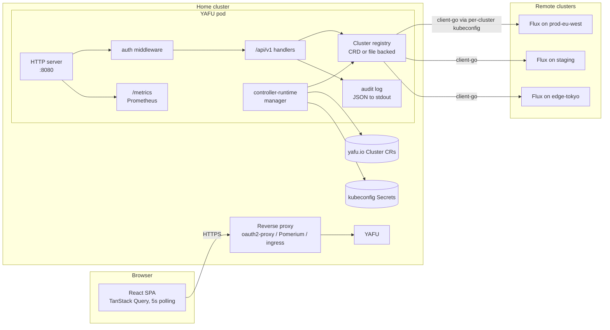
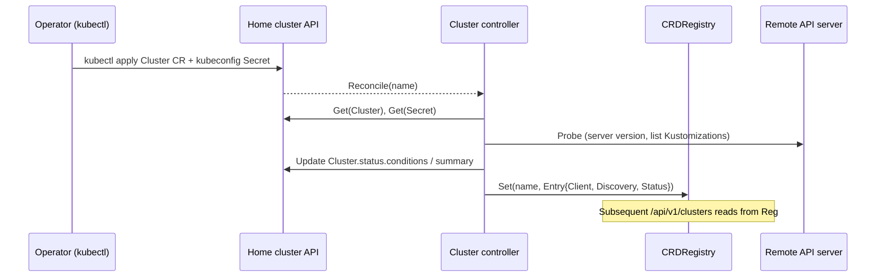
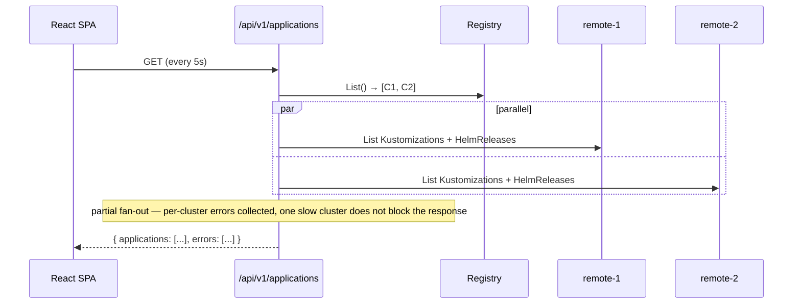
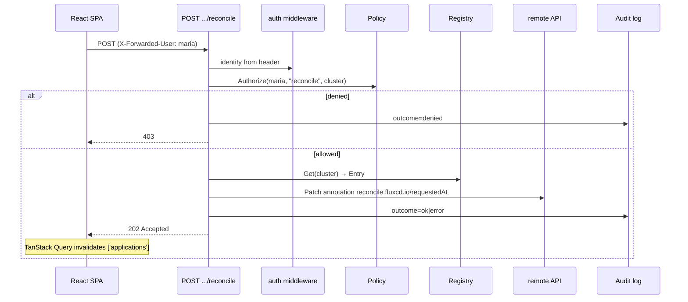

# yafu architecture

This is the v0.1 view. Phases past v0.1 (informers + SSE, native OIDC,
resource tree from Inventory) are noted but not pictured.

## Components

## Layers

| Layer | Package(s) | Responsibility |
|-------|-----------|----------------|
| HTTP server | `internal/server` | Mux setup, middleware (request-id, recover, observability), TLS termination is handled by ingress. |
| Auth | `internal/auth` | Identity resolution (anonymous / header-trust / native OIDC authorization-code-with-PKCE) and the RBAC policy engine. |
| API handlers | `internal/api` | One handler per resource: clusters, applications, sources, alerts, events, mutations, whoami, version, stream. |
| Cluster registry | `internal/cluster` | The `Registry` interface plus two implementations: `FileRegistry` (dev/CI) and `CRDRegistry` (production, populated by the controller). Per-cluster typed `client.Client` + `discovery.DiscoveryInterface`. Periodic `Probe` updates a `Status` snapshot. |
| Cluster controller | `internal/controllers` | `controller-runtime` Reconciler that watches `yafu.io/v1alpha1.Cluster` CRs, resolves credentials from `Secret`s (or in-cluster), builds clients, runs probes, updates CR status, and publishes the live entry into `CRDRegistry`. |
| Metrics | `internal/metrics` | Prometheus collectors (HTTP latency histogram, cluster gauges via pull-based `RegistryProvider`, probe counter). |
| Audit | `internal/audit` | One JSON line per privileged action to stdout. Mutex-guarded encoder. |
| Frontend | `web/` | React + Vite + TS + Tailwind; TanStack Query against `/api/v1/*`; localStorage prefs. |

## Key flows

### Cluster registration (CRD mode)

### Application list fan-out

### Reconcile mutation + audit

## Configuration knobs

| Flag | Default | Purpose |
|------|---------|---------|
| `--addr` | `:8080` | HTTP listen address. |
| `--cluster-mode` | `auto` | `crd` (in-cluster), `file` (kubeconfig contexts), or `auto` (file when a kubeconfig is detectable). |
| `--config-file` | "" | YAML cluster config (file mode). |
| `--kubeconfig` | "" | Auto-discover all contexts in this kubeconfig (file mode). |
| `--auth-mode` | `anonymous` | `anonymous` (dev), `header` (trust X-Forwarded-* from a proxy), `oidc` (deferred). |
| `--rbac-file` | "" | Path to RBAC policy YAML. Empty → allow-all-after-auth (with WARN). |
| `--metrics-addr` | `:8081` | controller-runtime's own metrics endpoint (CRD mode). `0` disables. |
| `--probe-addr` | `:8082` | controller-runtime's healthz (CRD mode). `0` disables. |
| `--otel-endpoint` | "" | OTLP HTTP collector endpoint. Empty disables tracing. |
| `--otel-insecure` | `true` | Skip TLS for the OTLP exporter (cluster-internal collectors typically use HTTP). |
| `--otel-sample-rate` | `1.0` | Head-based trace sampler ratio in [0.0, 1.0]. |

## Observability

yafu emits three signal types:

- **Logs** — structured JSON via `slog`, one line per request with
  request ID, method, path, status, latency, and identity. Audit
  records (one per privileged mutation) ride the same stream;
  the `audit:true` field disambiguates.
- **Metrics** — Prometheus exposition at `/metrics` (same port as
  the API). Histograms for HTTP latency by route + status,
  per-cluster probe success + Flux installation flag, registry
  size. The Helm chart can opt into a `ServiceMonitor` for
  prometheus-operator scrape.
- **Traces** — OpenTelemetry, OTLP HTTP exporter. Spans cover
  inbound HTTP requests (`otelhttp` middleware), the rendered
  Git-vs-cluster pipeline (artifact fetch, kustomize-build /
  helm-template, per-resource diff), per-cluster fan-out
  goroutines on list endpoints, and mutations (`mutate.{verb}`
  with cluster/ns/kind/name attributes).

Tracing is **off** by default — empty OTLP endpoint leaves the
global tracer provider as the no-op default and OTel calls
compile to near-zero-cost stubs. The W3C trace-context propagator
is installed regardless, so a `traceparent` header from an upstream
gateway flows through downstream calls even with the exporter
disabled.

Production deployments point `tracing.endpoint` in the Helm chart
at any OTLP-HTTP-compatible collector — Tempo, Honeycomb, Datadog,
Grafana Cloud, etc. Sample rate is configurable
(`tracing.sampleRate`, default 1.0). yafu is low-volume so
always-on sampling is affordable.

## Roadmap (deferred)

| Item | Status | Where |
|------|--------|-------|
| AI-assisted debugging | not started | see `memory/ai_assist_feature.md`. |
| Settings page real implementation | not started | currently mock; show identity, RBAC summary, audit settings. |
| postBuild substitutions in render | not started | requires ConfigMap/Secret reads in `internal/render`. |
| valuesFrom resolution in HelmRelease render | not started | same; needs `kubernetes.Interface` plumbed into the render package. |
| SOPS decryption in Kustomization render | not started | requires a SOPS keyring config. |
| Generate Go DTOs from `api/openapi.yaml` | not started | drops the manual parity step in `internal/api/types/types.go`. |
